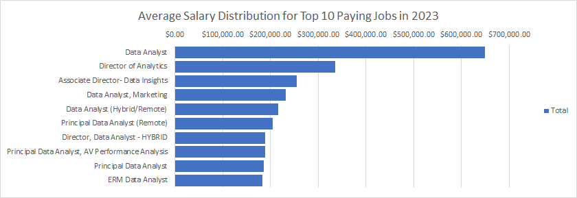
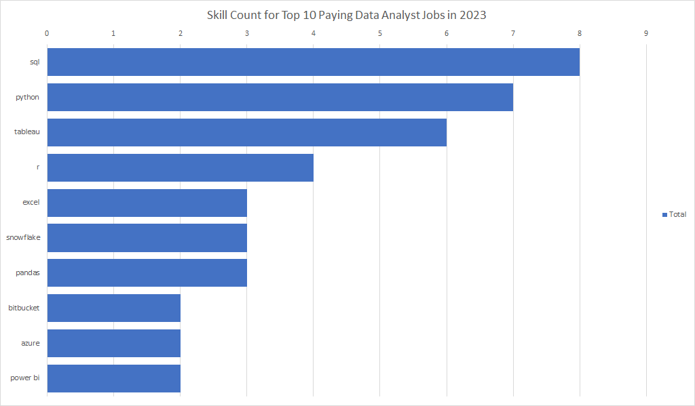
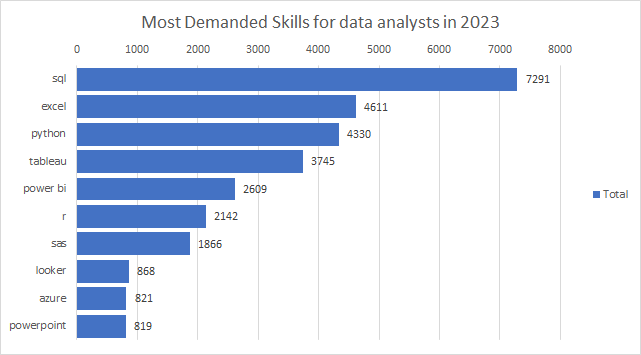
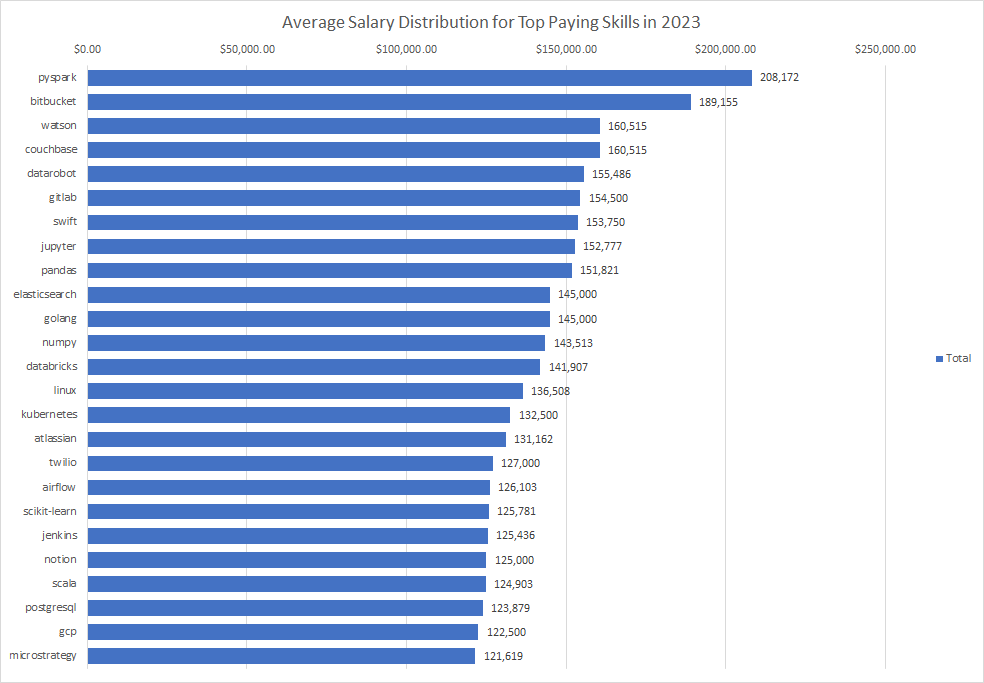
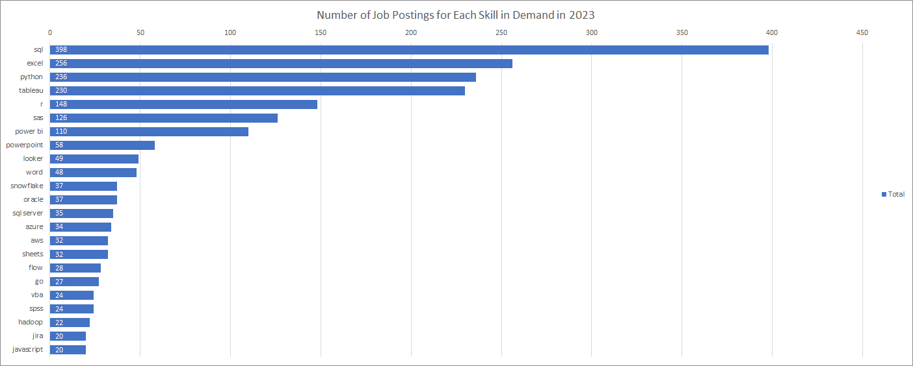
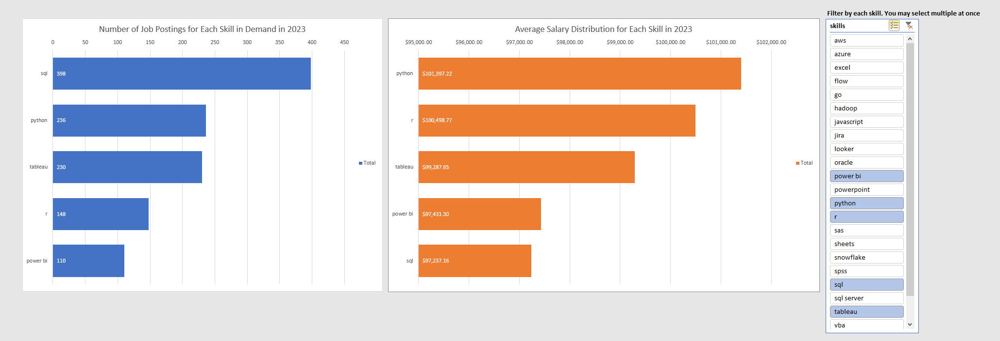

# SQL Project Data Job Analysis

## Introduction
This repository provides a comprehensive analysis of SQL data jobs in 2023, focusing on trends in required skills, average salaries, and industry demand. By leveraging a dataset of top-paying SQL data job postings, we aim to uncover the key factors that drive high compensation in this field. This analysis is intended to guide data professionals in understanding the current job market and identifying valuable skill sets for career advancement. 

Click the link down below to view SQL queries written in this project.

[project_sql folder](/project_sql/)

## Background
Driven by a desire to navigate the data analyst job market more effectively, this project aims to identify top-paid and in-demand skills, streamlining the process for others to find optimal jobs. 

The data, sourced from [SQL course](https://lukebarousse.com/sql) by Luke Barousse, is rich with insights on job titles, salaries, locations, and essential skills. 

The SQL queries were designed to answer the following questions: 
1. What are the top-paying data analyst jobs?
2. What skills are required for these top-paying jobs?
3. What skills are most in demand for data analysts?
4. Which skills are associated with higher salaries?
5. What are the most optimal skills to learn or improve upon?

## Tools I Used
For my deep dive into the data analyst job market, I used several key tools:

- **SQL**: The backbone of my analysis, allowing me to query the database and unearth critical insights.

- **PostgreSQL**: The chosen database management system, ideal for handling the job posting data.

- **Visual Studio Code**: My go-to for database management and executing SQL queries.

- **Git & GitHub**: Essential for version control and sharing my SQL scripts and analysis, ensuring collaboration and project tracking.

- **Excel**: For visualizing the filtered data into graphs, pivot tables, and interactive workbooks. All graphs and charts featured in this file are made in Excel.

## The Analysis
Each query for this project aimed at investigating specific aspects of the data analyst job market. Here’s how I approached each question:
### 1. Top Paying Data Analyst Jobs
To identify the highest-paying roles, I filtered data analyst positions by average yearly salary and location, focusing on remote jobs. This query highlights the lucrative opportunities in the field, providing a clear picture of where the most rewarding positions are located and what they entail.

```sql
SELECT
    job_id,
    job_title,
    job_location,
    job_schedule_type,
    salary_year_avg,
    job_posted_date,
    name AS company_name
FROM
    job_postings_fact
LEFT JOIN company_dim ON company_dim.company_id = job_postings_fact.company_id
WHERE   
    job_title_short = 'Data Analyst' AND
    job_location = 'Anywhere' AND
    salary_year_avg IS NOT NULL
ORDER BY
    salary_year_avg DESC
LIMIT 10;
```

<br>*Bar graph visualizing the salary for the top 10 salaries for data analysts*

- **Highest paying data analyst job in 2023:** Mantys offers $650,000 annually, significantly above other roles, indicating unique opportunities or special requirements.

- **Diversity in roles:** Top-paying positions include Director of Analytics, Associate Director- Data Insights, Principal Data Analyst, and ERM Data Analyst, spanning different levels and specializations.

- **Prominent companies and remote opportunities:** Meta, AT&T, Pinterest, and SmartAsset offer top salaries, reflecting high demand and acceptance of remote work in the data analytics industry.

### 2. What skills are required for these top-paying jobs?
To understand what skills are required for the top-paying jobs, I joined the job postings with the skills data, providing insights into what employers value for high-compensation roles.

```sql
WITH top_paying_jobs AS 
(
    SELECT
        job_id,
        job_title,
        salary_year_avg,
        name AS company_name
    FROM
        job_postings_fact
    LEFT JOIN company_dim ON company_dim.company_id = job_postings_fact.company_id
    WHERE   
        job_title_short = 'Data Analyst' AND
        job_location = 'Anywhere' AND
        salary_year_avg IS NOT NULL
    ORDER BY
        salary_year_avg DESC
    LIMIT 10
)

SELECT 
    top_paying_jobs.*,
    skills
FROM top_paying_jobs
INNER JOIN skills_job_dim ON top_paying_jobs.job_id = skills_job_dim.job_id
INNER JOIN skills_dim ON skills_job_dim.skill_id = skills_dim.skill_id
ORDER BY
    salary_year_avg DESC
```
The top 10 most frequently required skills for high-paying Data Analyst roles in 2023 are:

- SQL (8 occurrences)
- Python (7 occurrences)
- Tableau (6 occurrences)
- R (4 occurrences)
- Snowflake (3 occurrences)
- Pandas (3 occurrences)
- Excel (3 occurrences)
- Bitbucket (2 occurrences)
- Azure (2 occurrences)
- Power BI (2 occurrences)


*Bar graph visualizing the count of skills for the top 10 paying jobs for data analysts*

Insights:

- **SQL** is the most frequently required skill, highlighting its importance in data analysis and management.

- **Python** is also highly sought after, reflecting its versatility and widespread use in data analysis, machine learning, and automation.

- **Tableau** is the leading data visualization tool among the top-paying roles.

- Traditional tools like **Excel** still hold significant value, alongside modern tools like **Snowflake** for data warehousing and Pandas for data manipulation.

- Cloud services **(Azure)** and version control tools **(Bitbucket)** are also valued, indicating a preference for candidates with a broad skill set that includes cloud computing and software development practices.

### 3. What skills are most in demand for data analysts?
This query helped identify the skills most frequently requested in job postings, directing focus to areas with high demand.
```sql
SELECT 
    skills,
    COUNT(skills_job_dim.skill_id) AS demand_count
FROM job_postings_fact
INNER JOIN skills_job_dim ON job_postings_fact.job_id = skills_job_dim.job_id
INNER JOIN skills_dim ON skills_job_dim.skill_id = skills_dim.skill_id
WHERE
    job_title_short = 'Data Analyst' AND
    AND job_work_from_home = True
GROUP BY
    skills
ORDER BY
    demand_count DESC
LIMIT 10;
```
Here are some insights based on this list of the most in-demand skills for data analyst jobs:

<br>*Bar graph for the demand of the top 10 skills in data analyst job postings*

1. **High Demand for Technical Skills:**
   - **SQL** is the most in-demand skill with 7,291 mentions, indicating its critical role in data querying and database management.
   - **Excel** (4,611 mentions) remains a fundamental tool for data manipulation and analysis.
   - **Python** (4,330 mentions) is highly sought after, reflecting its versatility and extensive use in data analysis, automation, and machine learning.

2. **Visualization and BI Tools:**
   - **Tableau** (3,745 mentions) and **Power BI** (2,609 mentions) are the top visualization tools, showing the importance of being able to create and interpret data visualizations.
   - **Looker** (868 mentions) is also valued, though to a lesser extent, indicating its niche but relevant usage in some companies.

3. **Statistical and Analytical Tools:**
   - **R** (2,142 mentions) and **SAS** (1,866 mentions) are important for statistical analysis and advanced data manipulation.

4. **Cloud and Presentation Tools:**
   - **Azure** (821 mentions) highlights the need for cloud computing skills, reflecting the industry's move towards cloud-based solutions.
   - **PowerPoint** (819 mentions) demonstrates the ongoing importance of being able to present and communicate findings effectively.

5. **Overall Trend:**
   - The demand for a mix of technical skills (like SQL, Python, and Excel) and specialized tools (like Tableau, Power BI, and Azure) indicates that data analysts need to be versatile and proficient in both data manipulation and data visualization to meet the industry's requirements.
   - Presentation skills (e.g., PowerPoint) are also crucial, underscoring the need for analysts to convey their insights clearly to stakeholders.

### 4. Which skills are associated with higher salaries?
This query explores the average salaries associated with different skills revealed which skills are the highest paying.
```sql
SELECT 
    skills,
    ROUND (AVG(salary_year_avg), 2) AS avg_salary_yearly
FROM job_postings_fact
INNER JOIN skills_job_dim ON job_postings_fact.job_id = skills_job_dim.job_id
INNER JOIN skills_dim ON skills_job_dim.skill_id = skills_dim.skill_id
WHERE
    job_title_short = 'Data Analyst' AND
    salary_year_avg IS NOT NULL AND
    job_work_from_home = 'TRUE'
GROUP BY
    skills
ORDER BY
    avg_salary_yearly DESC
LIMIT 25;
```

*Bar graph for the average salary of top paying skills*

***Here are some insights:***

1. **Big Data and Cloud Technologies**:
    - **PySpark**: The highest paying skill ($208,172.25/year) indicates a strong demand for expertise in big data 
        processing and distributed computing.
    - **Databricks**: ($141,906.60/year) is another high-paying skill related to big data and analytics platforms.
    - **GCP (Google Cloud Platform)**: ($122,500/year) highlights the importance of cloud computing skills.

2. **Version Control and Collaboration Tools**:
    - **Bitbucket**: ($189,154.50/year) and **GitLab**: ($154,500/year) show that version control and collaboration 
        tools are highly valued, reflecting the importance of software development practices in data analysis.
    - **Jenkins**: ($125,436.33/year) further emphasizes the value of continuous integration and deployment (CI/CD) tools.

3. **Machine Learning and Data Science Libraries**:
    - **Pandas**: ($151,821.33/year), **Numpy**: ($143,512.50/year), and **Scikit-learn**: ($125,781.25/year) are key 
        libraries in the Python ecosystem, underscoring the need for strong data manipulation and machine learning skills.
    - **DataRobot**: ($155,485.50/year) indicates the value of automated machine learning platforms.

4. **Programming Languages**:
    - **Swift**: ($153,750/year) and **Golang**: ($145,000/year) show that proficiency in versatile programming languages 
        can command high salaries.
    - **Scala**: ($124,903/year) is also valued, likely for its use in data processing frameworks like Apache Spark.

5. **Specialized Databases and Search Technologies**:
    - **Couchbase**: ($160,515/year) and **Elasticsearch**: ($145,000/year) highlight the demand for skills in NoSQL 
        databases and search engines.
    - **PostgreSQL**: ($123,878.75/year) demonstrates the enduring value of expertise in relational databases.

6. **AI and Cognitive Services**:
    - **Watson**: ($160,515/year) indicates a significant demand for skills related to IBM's AI and cognitive services.

7. **DevOps and Containerization**:
    - **Kubernetes**: ($132,500/year) reflects the importance of container orchestration skills in modern data 
        infrastructure.

8. **Data Orchestration and Workflow Management**:
    - **Airflow**: ($126,103/year) shows the value of expertise in managing complex data workflows.


Overall, the trends suggest that top-paying skills for data analysts are heavily oriented towards big data processing, cloud 
        computing, machine learning, and modern software development practices. Expertise in specialized databases, 
        AI services, and data orchestration tools are also highly valued. Proficiency in popular programming languages 
        and data science libraries is crucial, along with strong knowledge of DevOps and containerization technologies.


### 5. What are the most optimal skills to learn or improve upon?
Combining insights from demand and salary data, this query aimed to pinpoint skills that are both in high demand and have high salaries, offering a strategic focus for skill development.
```sql
SELECT
    skills_dim.skill_id,
    skills_dim.skills,
    COUNT(skills_job_dim.skill_id) AS demand_count,
    ROUND (AVG(salary_year_avg), 2) AS avg_salary_yearly
FROM  
    job_postings_fact
INNER JOIN skills_job_dim ON job_postings_fact.job_id = skills_job_dim.job_id
INNER JOIN skills_dim ON skills_job_dim.skill_id = skills_dim.skill_id
WHERE
    job_title_short = 'Data Analyst' 
    AND salary_year_avg IS NOT NULL 
    AND job_work_from_home = 'TRUE'
GROUP BY
    skills_dim.skill_id
HAVING
    COUNT(skills_job_dim.job_id) >= 20
ORDER BY
    avg_salary_yearly DESC,
    demand_count DESC
LIMIT 25
```



*Bar graphs comparing each skill based on highest demand and highest salaries; To filter the graphs by skill, download the Excel Workbook [here](/excel%20workbooks/optimal_skills.xlsx)*

***Here are my insights:***
1. **Combination of High Demand and Good Salary**:
   - **Python** and **R** are both highly demanded and offer substantial salaries, making them optimal for data analysts to learn or improve upon.
   - **SQL** is the most demanded skill with a competitive salary, making it essential for data analysts.

2. **Specialized Tools with High Salaries**:
   - Learning **Go**, **Hadoop**, and **Snowflake** can lead to high-paying jobs, though their demand is lower. These skills are likely specialized and in niches where high expertise is valued.

3. **Cloud and Big Data Skills**:
   - **Azure** and **AWS** skills are highly rewarded, reflecting the industry's shift towards cloud computing and big data technologies.

4. **Visualization and BI Tools**:
   - **Tableau** and **Power BI** have significant demand and offer good salaries, highlighting the importance of data visualization skills.


***Most Optimal Skills to Learn or Improve Upon:*** 
1. **SQL**: Due to its high demand and good salary.
2. **Python**: High demand and good salary, versatile across many applications.
3. **R**: Highly valued for statistical analysis with good salary potential.
4. **Tableau**: Essential for data visualization with a strong demand.
5. **Power BI**: Another critical tool for visualization with significant demand.
6. **Cloud Technologies**: Learning **Azure** and **AWS** can open high-paying opportunities.
7. **Snowflake**: Increasingly popular for data warehousing with a high salary.

Focusing on these skills can maximize job opportunities and potential earnings in the data analytics field.
## What I Learned
In this project, I was able to dive deep into SQL, PostgreSQL, and VS Code for the first time, learning both basic and advanced techniques. I was able to apply fundamental concepts of merging tables, using subqueries and CTEs, and using JOIN functions to create complex queries for analysis. 

I also learned aggregate functions such as COUNT(), SUM() and AVG() to create insightful data tables, which in turn allowed me to apply my knowledge of Excel spreadsheet to visualize the data for presentation. 

Lastly, I learned how to solve real-world problems by using SQL queries to sort complex databases into an actionable solution that is valuable not only to me, but to those who have the same goals and aspirations as me. 
## Conclusions

### Key Insights from the Analysis:

- **Top-Paying Data Analyst Jobs**: The highest-paying remote data analyst positions offer a wide salary range, with the top salary reaching an impressive $650,000.

- **Skills for Top-Paying Jobs**: Advanced proficiency in SQL is essential for high-paying data analyst roles, underscoring its importance for earning a top salary.

- **Most In-Demand Skills**: SQL (along with Python and Excel) is the most demanded skill in the data analyst job market, making it crucial for job seekers to master.

- **Skills with Higher Salaries**: Specialized skills, such as SVN and Solidity, are linked to the highest average salaries, highlighting the value of niche expertise.

- **Optimal Skills for Job Market Value**: SQL and Python stand out by being in high demand and associated with substantial salaries, making it one of the most valuable skills for data analysts to learn to maximize their market value.

### Closing Thoughts

This project not only honed my SQL skills but also provided valuable insights into the data analyst job market. The findings guide prioritizing skill development and job search strategies. Aspiring data analysts can gain a competitive edge by focusing on high-demand, high-salary skills. This exploration emphasizes the importance of continuous learning and staying updated with emerging trends in data analytics.